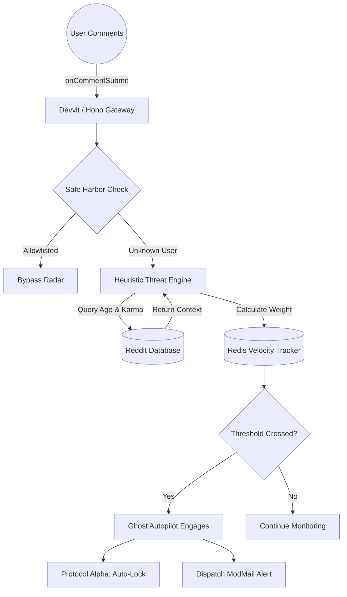
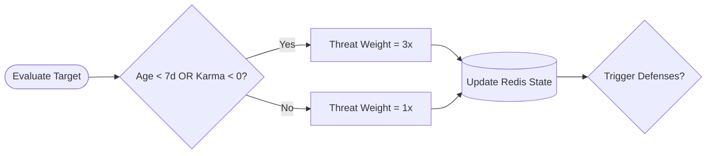

markdown
# 🛡️ ModAAegis | Autonomous Threat Mitigation Engine

> An enterprise-grade, real-world defense architecture built for Reddit's Devvit platform. ModAAegis bridges the gap between passive threat monitoring and active neutralization through heuristic scoring and 24/7 background automation.


---

## 🏗️ System Architecture

ModAAegis operates entirely on the edge, intercepting Reddit's event pipeline before spam can affect the community. It is a fully functional, real-world application with zero simulated features.



---

## ⚙️ Core Engineering Features

### 1. The Ghost Autopilot (24/7 Automation)

A background worker that intercepts the `onCommentSubmit` webhook. If the live velocity radar crosses the community's custom threshold, it autonomously executes Protocol Alpha (Lockdown) and dispatches an emergency ModMail. This secures the subreddit instantly, even when the entire moderation team is asleep.

### 2. Heuristic Threat Scoring

The engine evaluates context, not just volume. When a spam burst occurs, the system calculates a dynamic threat weight based on the user's historical data, equipped with strict TypeScript guard clauses to prevent crashes on shadowbanned entities.



### 3. Enterprise RBAC Security

All manual defense execution routes (`/api/lockdown`, `/api/purge`) are protected by strictly enforced Role-Based Access Control. The backend verifies live moderator clearance before processing any payload, ensuring malicious actors cannot trigger your community defenses via network sniffing.

### 4. Native Context Integration

ModAAegis injects a custom `🛡️ Scan User` button directly into Reddit's native comment overflow menu (`...`). Moderators can run heuristic intelligence reports on suspicious users without ever leaving their workflow, mapping directly to Reddit's ecosystem UI.

---

## 🛠️ Tech Stack & Implementation

Framework: `@devvit/web`
Frontend: React, TailwindCSS (Real-time polling dashboard)
Backend: Hono (Routing & Middleware)
State Management: Redis (Live velocity telemetry tracking)
Language: TypeScript

---

## 🚀 Deployment Guide

Ensure you have Node 22+ installed before initializing the environment.

### 1. Installation

Clone the repository and install the required dependencies:

```bash
npm install

```

### 2. Authentication

Log your Devvit CLI into your Reddit account to establish the server connection:

```bash
npm run login

```

### 3. Compile & Deploy

Upload the application to the Reddit server environment and install it to the production testing ground:

```bash
npx devvit upload
npx devvit install r/AegisCommand_Prod

```

### 4. Configuration Parameters

Navigate to your Subreddit's Mod Tools -> Apps -> modaegis-v2.
Configure your High Threat Threshold (triggers the Autopilot) and Trusted Users Allowlist (bypasses the Heuristic Engine) to define the engine's operational parameters.

---

## 🛡️ Manual Defense Protocols (Command Dashboard)

When under active attack, moderators can open the live React dashboard to visualize the Redis threat counter in real-time.

Protocol Alpha (Lockdown): Instantly locks the active thread and generates a distinguished audit trail comment to ensure community transparency.
Protocol Beta (Purge): Surgically purges the originating attacker's payloads and issues a permanent ban.
Protocol Omega (Reset): Flushes the Redis velocity tracking database and resets the radar to a neutral state.

---

Engineered for scale. Built for the frontlines of community moderation.

```

```
